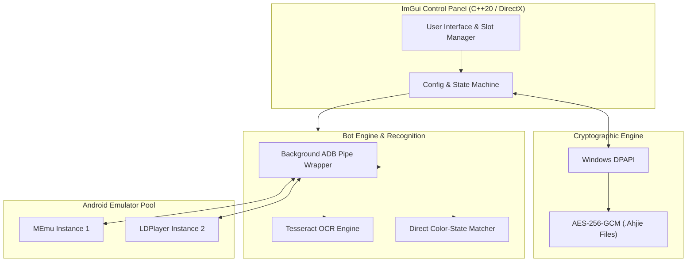

# 🌾 Hayday-Bot-Pro (Project Wheat)

[](https://github.com/YourUsername/Hayday-Bot-Pro/actions/workflows/ci.yml)
[](https://en.cppreference.com/w/cpp/20)
[](https://microsoft.com/windows)
[](docs/ahjie-encryption.md)
[](LICENSE)

> **Hayday-Bot-Pro is a lightweight, zero-CPU overhead C++20 automation engine and ImGui control panel designed to manage multi-account Hay Day operations seamlessly across Android emulators.** 
> By combining Tesseract OCR, hardware-backed Windows DPAPI encryption (`.Ahjie`), and ADB background multi-instance routing, it eliminates high CPU usage, fragile pixel scripts, and insecure plain-text credentials.

---

## 📸 Demo & Interface

*(Insert animated UI demo / GIF of ImGui control panel and automated emulator rotation here)*

```
+-----------------------------------------------------------------------+
|  [Hayday-Bot-Pro v2.0 - ImGui Engine]                                 |
|  Active Instance: MEmu_1 (640x480 DirectX)                             |
|  Status: Running | OCR State: Harvesting Wheat | Accounts: 8 Active  |
|  [ Start Engine ]   [ Stop Engine ]   [ Account Manager (.Ahjie) ]   |
+-----------------------------------------------------------------------+
```

---

## ⚡ One-Command Quickstart

Get up and running in **under 60 seconds**:

```cmd
:: Clone repository and launch quickstart helper
git clone https://github.com/YourUsername/Hayday-Bot-Pro.git
cd Hayday-Bot-Pro
quickstart.bat
```

> [`quickstart.bat`](file:///d:/02_Projects/HD/HaydayMod/quickstart.bat) automatically detects your local build tools, verifies ADB installation, compiles `Release|x64`, and launches the ImGui GUI interface.

---

## 🏗️ System Architecture



---

## 🚀 Key Features

* **⚡ Ultra-Low CPU Footprint**: Built entirely in native C++20 with DirectX/ImGui rendering—no heavy Python runtimes or Electron wrappers.
* **🔐 Hardware-Protected Credentials (`.Ahjie`)**: Stores account profiles in AES-256-GCM encrypted format tied to machine identity via Windows DPAPI.
* **👁️ Precision OCR & Visual State Detection**: Integrated Tesseract OCR reads level numbers, coin balances, diamond counts, and item quantities accurately.
* **🔄 Multi-Instance Background Rotation**: Rotates through minimized MEmu or LDPlayer instances without taking over user mouse or keyboard.

---

## ⚙️ Emulator Configuration Checklist

For optimal OCR accuracy and pixel state matching, ensure your emulator matches these parameters:

| Parameter | Recommended Setting | Note |
| :--- | :--- | :--- |
| **Resolution** | `640 x 480` | Required for OCR alignment |
| **DPI** | `100 DPI` | Required for coordinate mapping |
| **Graphics Engine** | `DirectX` | Prevents frame buffer tearing |
| **Permissions** | `Root Enabled` | Allows background touch routing |
| **In-Game Language**| `English` | Required for Tesseract traineddata |

---

## 🤝 Open for Contributors

We welcome contributions of all kinds! Whether you want to polish the ImGui interface, optimize ADB packet routing, or improve OCR dataset alignment:

- Read our **[CONTRIBUTING.md](file:///d:/02_Projects/HD/HaydayMod/CONTRIBUTING.md)** guide.
- Check out open issues tagged **[`good first issue`](https://github.com/issues?q=label%3A"good+first+issue")** or **[`help wanted`](https://github.com/issues?q=label%3A"help+wanted")**.
- Submit Pull Requests using feature branches (`feature/xyz` or `fix/abc`).

---

## 📣 Strategic Visibility & Community Roadmap

Want to learn how we designed this engine or submit Hayday-Bot-Pro to curated list ecosystems? Check out **[docs/COMMUNITY_OUTREACH.md](file:///d:/02_Projects/HD/HaydayMod/docs/COMMUNITY_OUTREACH.md)** for our promotion guide and `awesome-*` PR submission templates.

---

## 🛑 Important Notices

> [!WARNING]
> Automated interaction with third-party game clients may violate terms of service. Use responsibly on secondary or testing accounts.
