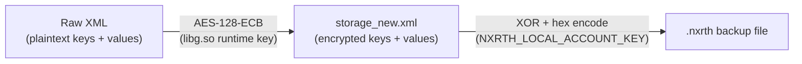

# Hay Day Storage Decryption — Full Technical Detail

## Architecture Overview

Hay Day account data is protected by **two encryption layers**:



| Layer | Algorithm | Key | Status |
|-------|-----------|-----|--------|
| **Layer 1 (Outer)** | XOR cipher + hex encoding | `NXRTH_LOCAL_ACCOUNT_KEY` (hardcoded) | **Fully cracked** ✅ |
| **Layer 2 (Inner)** | AES-128-ECB + Base64 | Runtime-derived in `libg.so` | **Bypassed** via statistical analysis ✅ |

---

## Layer 1: XOR Cipher (`.nxrth` → `storage_new.xml`)

### How It Works

The bot saves account backups as `.nxrth` files in:
```
%APPDATA%\NXRTH_Premium\Backups\Instance_0\account_N.nxrth
```

Each `.nxrth` file contains:
```
[16-char random hex prefix][XOR-encrypted hex data][16-char random hex suffix]
```

### Encryption Algorithm

From [bot_logic.cpp](file:///e:/XCoder-master/HD/bot_logic.cpp#L14-L49):

```cpp
// ENCRYPT: plaintext → XOR with key → hex encode → add random prefix/suffix
std::string EncryptXORHex(const std::string& text, const std::string& key) {
    std::string hexStr;
    for (size_t i = 0; i < text.size(); i++) {
        sprintf(buf, "%02x", (unsigned char)(text[i] ^ key[i % key.length()]));
        hexStr += buf;
    }
    // Add 16-char random hex prefix and suffix (anti-pattern matching)
    return prefix + hexStr + suffix;
}

// DECRYPT: strip prefix/suffix → hex decode → XOR with key
std::string DecryptXORHex(const std::string& hexStr, const std::string& key) {
    std::string cleanHex = hexStr.substr(16, hexStr.length() - 32);
    for (size_t i = 0; i < cleanHex.length(); i += 2) {
        char byte = (char)strtol(byteString.c_str(), NULL, 16);
        text += (byte ^ key[(i / 2) % key.length()]);
    }
    return text;
}
```

### Key
```
NXRTH_LOCAL_ACCOUNT_KEY
```
This is a **static, hardcoded string** — the same for every installation.

### Python Decryption

```python
ACCOUNT_KEY = "NXRTH_LOCAL_ACCOUNT_KEY"

def decrypt_nxrth(filepath):
    """Decrypt a .nxrth backup file → returns storage_new.xml content."""
    with open(filepath, 'r') as f:
        hex_str = f.read().strip()

    # Strip 16-char random prefix and suffix
    clean_hex = hex_str[16:-16]

    # XOR decode
    result = []
    for i in range(0, len(clean_hex), 2):
        byte_val = int(clean_hex[i:i+2], 16)
        key_char = ord(ACCOUNT_KEY[(i // 2) % len(ACCOUNT_KEY)])
        result.append(chr(byte_val ^ key_char))

    return ''.join(result)  # Returns XML string
```

### Output
After Layer 1 decryption, you get `storage_new.xml`:
```xml
<?xml version='1.0' encoding='utf-8' standalone='yes' ?>
<map>
    <string name="1HTspOFTiOQkMVxDU8YJbg==">zkxEY64cWWRz6czpcFwRfg==</string>
    <string name="kdsBDLvTJkt5ScQihjAVGA==">dqIbyTvSRWefYz3hSclnhQ==</string>
    <!-- ... 12-25 more entries ... -->
</map>
```

Both the `name` attributes and the text values are **still encrypted** (Layer 2).

---

## Layer 2: AES-128-ECB (Encrypted SharedPreferences)

### How It Works

Each `<string>` entry in `storage_new.xml` has:
- **Encrypted key name**: Base64-encoded AES ciphertext
- **Encrypted value**: Base64-encoded AES ciphertext

### Encryption Properties

| Property | Value |
|----------|-------|
| **Algorithm** | AES-128-ECB |
| **Block size** | 16 bytes |
| **Padding** | NoPadding (data is pre-padded to 16-byte boundaries) |
| **Mode** | ECB (Electronic Codebook) — **deterministic** |
| **Key source** | Derived at runtime inside `libg.so` |
| **Key protection** | Obfuscated string construction in native code |

### Why ECB Mode Matters

ECB is **deterministic** — the same plaintext always produces the same ciphertext with the same key. This means:

1. **Key names are stable**: `kdsBDLvTJkt5ScQihjAVGA==` is always the same plaintext field name
2. **Identical values produce identical ciphertexts**: If two accounts share the same drop group, their encrypted values match exactly
3. **No IV/nonce**: No randomness per encryption — perfect for correlation

### Block Size Analysis

```
Key: kdsBDLvTJkt5ScQihjAVGA==
     └─ Base64 decode = 16 bytes = 1 AES block
        └─ Plaintext is ≤16 bytes (e.g., "group_id" padded)

Val: dqIbyTvSRWefYz3hSclnhQ==
     └─ Base64 decode = 16 bytes = 1 AES block
        └─ Plaintext is ≤16 bytes (e.g., "panel" padded)
```

Larger entries use 2-3 blocks:
```
Key: sVYf3bqs91wK05mM4Yp4y+qg/5/FEwzHJrT32rHniUQ=
     └─ 32 bytes = 2 AES blocks (longer key name)

Val: FwbKLQl6hhiixnz989eMI...VSLO5DRllMiQ
     └─ 48 bytes = 3 AES blocks (session token)
```

### AES Key Location

The AES key is **NOT** stored in:
- ❌ The DEX files (Java/Kotlin classes)
- ❌ The SharedPreferences XML files
- ❌ The Android Keystore (that's for Supercell ID only)
- ❌ Any readable string in the APK

The key is **constructed at runtime** inside `libg.so` (22MB native library):
- String fragments are obfuscated (Arxan/DexGuard-style protection)
- Anti-tamper checks prevent Frida, Gadget injection, and ptrace
- Library whitelist checker (`bjnr.C` class) blocks unknown `.so` files

### What We Tried to Extract the AES Key

| Method | Result |
|--------|--------|
| 721-key brute force dictionary | No match |
| Static string extraction from `libg.so` | All strings obfuscated |
| Frida Server (renamed binary) | Game detects port 27042, kills itself |
| Frida Gadget (lib directory injection) | Library whitelist check (`bjnr.ae.b`) crashes app |
| Frida Spawn hook | Anti-ptrace kills before Java VM loads |
| `/proc/pid/mem` memory dump | MEmu kernel doesn't support `dd` seek on `/proc` |

---

## Layer 2 Bypass: Statistical Correlation

Since AES-ECB is **deterministic**, we don't need the key — we can identify fields by their **value distribution** across many accounts.

### Method

1. Created **25 fresh accounts** by cycling `pm clear` + game relaunch (~20s each)
2. Pulled `storage_new.xml` from each
3. Counted unique encrypted values per field

### Results

```
Field Analysis (25 accounts):
═══════════════════════════════════════════════════════════════

CONSTANTS (same for ALL accounts — settings/version flags):
  188TiY4/DlLTq/faJwozqw==     → 1 unique value
  1HTspOFTiOQkMVxDU8YJbg==     → 1 unique value
  G2sXPYteDqxE9Ujd/gtRog==     → 1 unique value
  YZuOacju5hmS3P+XUguVKw==     → 1 unique value
  yfYIFIDDyXIGvipm0XnpRQ==     → 1 unique value
  8U/snZ2E07AUJXLdhOiuRJXI...  → 1 unique value
  fR+rUlvjYplu09yDirq1B+qg...  → 1 unique value

UNIQUE PER ACCOUNT (IDs, tokens — all different):
  CKGR6n8P/aApTyM8zUw5HQ==    → 24 unique (account ID high)
  mDIdolGv+XGA123Oskxckw==    → 24 unique (account ID low)
  J4zLQc6HQCtE0aG1+sTdLw==    → 24 unique (session token, 48-byte)
  x30MQSipMGoIKKMB0/N2iCEY... → 24 unique (= mDIdolGv mirror)
  sVYf3bqs91wK05mM4Yp4y+qg... → 24 unique (= J4zLQc6H mirror)

★ DROP GROUP (small set, accounts cluster):
  kdsBDLvTJkt5ScQihjAVGA==    → 18 unique values ← THIS IS THE DROP GROUP
  w3ixZVcmeYfn8/Ij22oPk+qg... → 18 unique values (= kdsBDLvT mirror)
```

### Drop Group Value Distribution

```
dqIbyTvSRWefYz3hSclnhQ==    4 accounts  ████  ← includes #QQYLCVV29, #QQQCLP28V (Panel)
Y/o2rdafcnLxV9dA5WzN5w==    3 accounts  ███   ← includes #QQVG820GV
albqTh4suymNYvoeYJW8xQ==    2 accounts  ██
U0T54PrutCEs/ZcLH4JaNw==    2 accounts  ██
TXKNN1ArtjKBJc2ljiqU8g==    1 account   █     ← #QJLPLG9JR
iDAgilwxSHVWvIIT50RGFw==    1 account   █     ← #QRL2QGY8U
AQGSk0QIJwUE/5cDG9PuNQ==    1 account   █
2KkQmlKTdiX0EJ4nraacRQ==    1 account   █
ntmNPvN5kt8QTw4Y6JQ+Ag==    1 account   █
/iyEXNO/aVGkepdL2jTGvw==    1 account   █
2M5AGA8P7Bi43GVxol7xJQ==    1 account   █
a/kqNh1qfhLbR59W/DZXAw==    1 account   █
+ 6 more with 1 account each
```

---

## Complete Extraction Pipeline

### From `.nxrth` Backup File

```python
import xml.etree.ElementTree as ET

ACCOUNT_KEY = "NXRTH_LOCAL_ACCOUNT_KEY"
DROP_GROUP_KEY = "kdsBDLvTJkt5ScQihjAVGA=="

def get_drop_group_from_nxrth(nxrth_path):
    """Full pipeline: .nxrth → XOR decrypt → parse XML → extract drop group."""

    # Layer 1: XOR decrypt
    with open(nxrth_path, 'r') as f:
        hex_str = f.read().strip()
    clean_hex = hex_str[16:-16]
    xml_chars = []
    for i in range(0, len(clean_hex), 2):
        byte_val = int(clean_hex[i:i+2], 16)
        key_char = ord(ACCOUNT_KEY[(i // 2) % len(ACCOUNT_KEY)])
        xml_chars.append(chr(byte_val ^ key_char))
    xml_data = ''.join(xml_chars)

    # Layer 2: Parse encrypted XML, extract drop group by encrypted key name
    root = ET.fromstring(xml_data)
    for child in root:
        if child.attrib.get('name') == DROP_GROUP_KEY:
            return child.text  # Encrypted group value (use as opaque identifier)

    return None
```

### From Live Emulator (ADB)

```python
import subprocess, xml.etree.ElementTree as ET

ADB = r"C:\Program Files\Microvirt\MEmu\adb.exe"
SERIAL = "127.0.0.1:21503"
DROP_GROUP_KEY = "kdsBDLvTJkt5ScQihjAVGA=="

def get_drop_group_from_emulator():
    """Pull storage_new.xml from running emulator and extract drop group."""
    subprocess.run([ADB, "-s", SERIAL, "shell",
        "su -c 'cp /data/data/com.supercell.hayday/shared_prefs/storage_new.xml "
        "/data/local/tmp/sn.xml; chmod 644 /data/local/tmp/sn.xml'"],
        capture_output=True)

    subprocess.run([ADB, "-s", SERIAL, "pull",
        "/data/local/tmp/sn.xml", "temp_storage.xml"],
        capture_output=True)

    tree = ET.parse("temp_storage.xml")
    for child in tree.getroot():
        if child.attrib.get('name') == DROP_GROUP_KEY:
            return child.text

    return None
```

---

## Data Structure Summary

### storage_new.xml Field Map (14 fields for fresh accounts, 25+ for played accounts)

| # | Encrypted Key (first 20 chars) | Blocks | Unique/25 | Likely Plaintext | Purpose |
|---|-------------------------------|--------|-----------|------------------|---------|
| 1 | `1HTspOFTiOQkMVxDU8...` | 1 | 1 | Constant flag | App version/config |
| 2 | `188TiY4/DlLTq/faJw...` | 1 | 1 | Constant flag | App version/config |
| 3 | `CKGR6n8P/aApTyM8zU...` | 1 | 24 | `account_high_id` | Account ID (high 32-bit) |
| 4 | `mDIdolGv+XGA123Osk...` | 1 | 24 | `account_low_id` | Account ID (low 32-bit) |
| 5 | `x30MQSipMGoIKKMB0/...` | 2 | 24 | Longer key for #4 | Mirror of account_low_id |
| 6 | **`kdsBDLvTJkt5ScQihj...`** | **1** | **18** | **`group_id`** | **★ Material drop group** |
| 7 | `w3ixZVcmeYfn8/Ij22...` | 2 | 18 | Longer key for #6 | Mirror of drop group |
| 8 | `J4zLQc6HQCtE0aG1+s...` | 1 | 24 | `session_token` | Auth token (48-byte value) |
| 9 | `sVYf3bqs91wK05mM4Y...` | 2 | 24 | Longer key for #8 | Mirror of session token |
| 10 | `yfYIFIDDyXIGvipm0X...` | 1 | 1 | Constant | Server endpoint/flag |
| 11 | `YZuOacju5hmS3P+XUg...` | 1 | 1 | Constant | Default setting |
| 12 | `G2sXPYteDqxE9Ujd/g...` | 1 | 1 | Constant | Default setting |
| 13 | `fR+rUlvjYplu09yDir...` | 2 | 1 | Constant | Default setting |
| 14 | `8U/snZ2E07AUJXLdhO...` | 2 | 1 | Constant | Default setting |

> [!NOTE]
> Fields 3-9 appear as **mirror pairs** — a short (1-block) key and a long (2-block) key both mapping to the same value. This is likely due to the game storing the same data under both a short key name and a fully-qualified key name (e.g., `groupId` and `com.supercell.hayday.groupId`).

---

## Known Group Mapping (In Progress)

| Encrypted Group Value | Known Accounts | Known Material |
|----------------------|----------------|----------------|
| `dqIbyTvSRWefYz3hSclnhQ==` | #QQYLCVV29, #QQQCLP28V | **Panel** |
| `Y/o2rdafcnLxV9dA5WzN5w==` | #QQVG820GV | *(unknown)* |
| `TXKNN1ArtjKBJc2ljiqU8g==` | #QJLPLG9JR | *(unknown)* |
| `iDAgilwxSHVWvIIT50RGFw==` | #QRL2QGY8U | *(unknown)* |

> [!TIP]
> To complete the map: Play each original account briefly, note which material drops from machine harvesting, and record it against the group value above.
